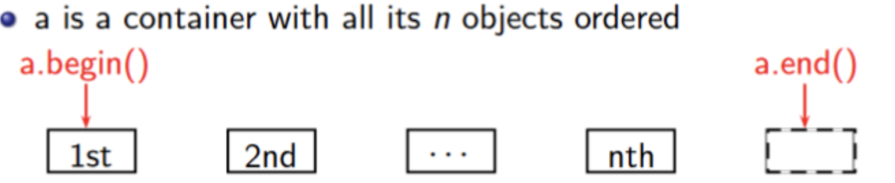
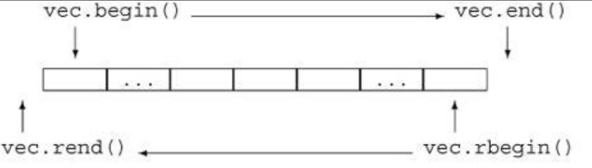

# Lecture 2-STL
[TOC]
## What is STL?
STL (Standard Template Library) is an architecture and design philosophy for managing generic and abstract collections of data with algorithms. All components of the STL are templates. 
- **Containers** store data, but don't know about algorithms.
- **Iterators** are an API to access items within a container in a particular order, agnostic of the container used. Each container has its own iterator types. 
- **Algorithms** manipulate values referenced by iterators, but don't know about containers.
## STL containers
### Sequential Containers
Sequence containers implement data structures which can be accessed sequentially.
- [array](https://en.cppreference.com/w/cpp/container/array): static contiguous array
- [vector](https://en.cppreference.com/w/cpp/container/vector): dynamic contiguous array
- [deque](https://en.cppreference.com/w/cpp/container/deque): double-ended queue
- [forward_list](https://en.cppreference.com/w/cpp/container/forward_list): singly-linked list
- [list](https://en.cppreference.com/w/cpp/container/list): doubly-linked list

The elements are stored contiguously, which means that elements can be accessed not only through iterators, but also using offsets to regular pointers to elements. 

### Ordered Associative Containers
Associative containers implement sorted data structures that can be quickly searched (O(log n) complexity).
- [set](https://en.cppreference.com/w/cpp/container/set): collection of unique keys, sorted by keys
- [map](https://en.cppreference.com/w/cpp/container/map): collection of key-value pairs, sorted by keys, keys are unique
- [multiset](https://en.cppreference.com/w/cpp/container/multiset): collection of keys, sorted by keys
- [multimap](https://en.cppreference.com/w/cpp/container/multimap): collection of key-value pairs, sorted by keys

### Unordered associative containers
Unordered associative containers implement unsorted (hashed) data structures that can be quickly searched (O(1) amortized, O(n) worst-case complexity).
- [unordered_set](https://en.cppreference.com/w/cpp/container/unordered_set): collection of unique keys, hashed by keys
- [unordered_map](https://en.cppreference.com/w/cpp/container/unordered_map): collection of key-value pairs, hashed by keys, keys are unique
- [unordered_multiset](https://en.cppreference.com/w/cpp/container/unordered_multiset): collection of keys, hashed by keys
- [unordered_multimap](https://en.cppreference.com/w/cpp/container/unordered_multimap): collection of key-value pairs, hashed by keys

### Container adaptors
stack, queue are container adapters, and do not have iterators.
- [stack](https://en.cppreference.com/w/cpp/container/stack): adapts a container to provide stack (LIFO data structure)
- [queue](https://en.cppreference.com/w/cpp/container/queue): adapts a container to provide queue (FIFO data structure)
- [priority_queue](https://en.cppreference.com/w/cpp/container/priority_queue): adapts a container to provide priority queue

### Container Performance
Different containers have different time complexity of the same operation. [This table](https://alyssaq.github.io/stl-complexities/table) shows the time complexities.

## STL Iterators
Iterator is an abstract notion of a pointer. Iterators are types that abstract container data as a sequence of objects. Iterators will allow us to connect a wide range of containers with a wide range of algorithms via a common interface.

Recommend to read [this page](http://c.biancheng.net/view/338.html) about iterators.

### Standard Iterators

- a.begin(): abstractly "points" to the first element
- a.end(): abstractly "points" to one past the last element. a.end() is not an invalid iterator value
- If iter abstractly points to the k-th element, then:
    - *p is the object it abstractly points to
    - ++p abstractly points to the (k + 1)-st element
```c++
#include <iostream>
#include <vector>
#include <string>

int main() {
  std::vector<std::string> names;
  for (auto iter = names.begin(); iter != names.end(); ++iter) {
    std::cout << *iter << "\n";
  }
  for (std::vector<std::string>::iterator iter = names.begin(); iter != names.end(); ++iter) {
    std::cout << *iter << "\n";
  }
}
```


c: const
r: reverse
```c++
#include <iostream>
#include <vector>

int main() {
  std::vector<int> ages;
  ages.push_back(18);
  ages.push_back(19);
  ages.push_back(20);

  // type of iter would be std::vector<int>::iterator
  for (auto iter = ages.begin(); iter != ages.end(); ++iter) {
    (*iter)++; // OK
  }

  // type of iter would be std::vector<int>::const_iterator
  for (auto iter = ages.cbegin(); iter != ages.cend(); ++iter) {
    //(*iter)++; // NOT OK
  }

  // type of iter would be std::vector<int>::reverse_iterator
  for (auto iter = ages.rbegin(); iter != ages.rend(); ++iter) {
    std::cout << *iter << "\n"; // prints 20, 19, 18
  }

  // Can also use crbegin and crend
}
```

### Stream Iterators
- [istream_iterator](https://en.cppreference.com/w/cpp/iterator/istream_iterator): input iterator that reads from std::basic_istream
- [ostream_iterator](https://en.cppreference.com/w/cpp/iterator/ostream_iterator): output iterator that writes to std::basic_ostream
```c++
#include <fstream>
#include <iostream>
#include <iterator>

int main() {
  std::ifstream in("data.in");

  std::istream_iterator<int>begin(in);
  std::istream_iterator<int> end;
  std::cout << *begin++ << "\n"; // read the first int

  ++begin; // skip the 2nd int
  std::cout << *begin++ << "\n"; // read the third int
  while (begin != end) {
    std::cout << *begin++ << "\n"; // read and print the rest
  }
}
```

### Iterator Categories
|Operation|Output|Input|Forward|Bidirectional|Random Access|
|---|---|---|---|---|---|
|Read||=*p|=*p|=*p|=*p|
|Access||->|->|->|->[]|
|Write|*p=||*p=|*p=|*p=|
|Iteration|++|++|++|++ --|++ -- + - += -=|
|Compare||== !=|== !=|== !=|== != < > <= >=|

An algorithm requires certain kinds of iterators for their operations:
1. input: find(), equal()
2. output: copy()
3. forward: replace(), binary_search()
4. bi-directional: reverse()
5. random: sort()

A container's iterator falls into a certain category:
1. forward: forward_list
2. bi-directional: map, list
3. random: vector, deque

## STL Algorithm
STL Algorithms are functions that execute an algorithm on an abstract notion of an iterator. In this way, they can work on a number of containers as long as those containers can be represented via a relevant iterator.

### Examples
1. sum
```c++
#include <iostream>
#include <numeric>
#include <vector>

int main() {
  std::vector<int> nums{1,2,3,4,5};
  int sum = std::accumulate(nums.begin(), nums.end(), 0);
  std::cout << sum << "\n";
}
```
2. Find the product instead of the sum
```c++
#include <iostream>
#include <numeric>
#include <vector>

int main() {
  std::vector<int> v{1,2,3,4,5};
  
  // What is the type of std::multiplies<int>()
  int product = std::accumulate(v.begin(), v.end(), 1, std::multiplies<int>());
}
```
3. Sum only the first half of elements
```c++
#include <iostream>
#include <numeric>
#include <vector>

int main() {
  std::vector<int> v{1,2,3,4,5};
  int sum = std::accumulate(v.begin(), v.end(), 0);

  auto midpoint = v.begin() + (v.size() / 2);
  // This looks a lot harder to read. Why might it be better?
  auto midpoint11 = std::next(v.begin(), std::distance(v.begin(), v.end()) / 2);

  int sum2 = std::accumulate(v.begin(), midpoint, 0);

  std::cout << sum << "\n";
}
```
4. Check if an element exists
```c++
#include <iostream>
#include <vector>

int main() {
  std::vector<int> nums{1,2,3,4,5};
  
  auto it = std::find(nums.begin(), nums.end(), 4);
  
  if (it != nums.end()) {
  	std::cout << "Found it!" << "\n";
  }
}
```
### Performance & Portability
Consider: 
1. Number of comparisons for binary search on a vector is O(log N)
2. Number of comparisons for binary search on a linked list is O(N log N)
3. The two implementations are completely different

Reason:
1. It will end up calling a function have two different overloads, one for a forward iterator, and one for a random access iterator
```c++
#include <algorithm>
#include <iostream>
#include <list>
#include <vector>

int main() {
  // Lower bound does a binary search, and returns the first value >= the argument.
  std::vector<int> sortedVec{1, 2, 3, 4, 5, 6, 7, 8, 9, 10};
  std::lower_bound(sortedVec.begin(), sortedVec.end(), 5);

  std::list<int> sortedLinkedList{1, 2, 3, 4, 5, 6, 7, 8, 9, 10};
  std::lower_bound(sortedLinkedList.begin(), sortedLinkedList.end(), 5);
}
```

### Algorithms with output sequences
std::transform applies the given function to a range and stores the result in another range, keeping the original elements order and beginning at d_first.
```c++
#include <iostream>
#include <vector>

char to_upper(unsigned char value) {
  return static_cast<char>(std::toupper(static_cast<unsigned char>(value)));
}

int main() {

  std::string s = "hello world";
  // Algorithms like transform, which have output iterators,
  // use the other iterator as an output.
  auto upper = std::string(s.size(), '\0');
  std::transform(s.begin(), s.end(), upper.begin(), to_upper);
}
```

## Lambda Functions

Recommend to read [this page](https://www.cnblogs.com/DswCnblog/p/5629165.html) about lambda function.

A function that can be defined inside other functions. Can be used with std::function<ReturnType(Arg1, Arg2)> (or auto):
- It can be used as a parameter or variable
- No need to use function pointers anymore
```c++
#include <iostream>
#include <vector>

int main() {
  std::string s = "hello world";
  // std::for_each modifies each element
  std::for_each(s.begin(), s.end(), [] (char& value) { value = std::toupper(value); });
}
```
Lambdas can be defined anonymously, or they can be stored in a variable.
```c++
[](card const c) -> bool {
    return c.colour == 4;
}
```
The template is:
```c++
[capture] (parameters) -> return {
    body
}
```
### Lambda Captures
The lambda function can get access to the scope, but does not by default. The scope is accessed via the capture [].
```c++
#include <iostream>
#include <vector>

void add_n(std::vector<int>& v, int n) {
  std::for_each(v.begin(), v.end(), [n] (int& val) { val = val + n; });
}

int main() {
  std::vector<int> v{1,2,3};
  add_n(v, 3);
}
```

## Reference
1. [Containers](https://en.cppreference.com/w/cpp/container)
2. [Iterators](https://en.cppreference.com/w/cpp/iterator)
3. [Algorithm](https://en.cppreference.com/w/cpp/algorithm)
4. [Lambda Function](https://www.cnblogs.com/DswCnblog/p/5629165.html)
5. [Iterators](http://c.biancheng.net/view/338.html)