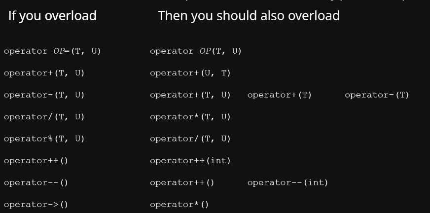

# Lecture 4-Operator Overloading
[TOC]
# Operator overloading
Operator overloads allow you to decrease your code complexity and utilise well defined semantics.

## Start Example
```c++
#include <iostream>

class point {
public:
	point(int x, int y)
	: x_{x}
	, y_{y} {};
	[[nodiscard]] int const x() const {
		return this->x_; }
	[[nodiscard]] int const y() const {
		return this->y_; }
	static point add(point const& p1, point const& p2);

private:
	int x_;
	int y_;
};

void print(std::ostream& os, point const& p) {
	os << "(" << p.x() << "," << p.y() << ")";
}

point point::add(point const& p1, point const& p2) {
	return point{p1.x() + p2.x(), p1.y() + p2.y()};
}

auto main() -> int {
	point p1{1, 2};
	point p2{2, 3};
	print(std::cout, point::add(p1, p2));
	std::cout << "\n";
}
```
Line 32 is our best attempt to "Add two points together and print them":
```c++
print(std::cout, point::add(p1, p2));
```
This is clumsy and ugly. We'd much prefer to have a semantic like this:
```c++
std::cout << p1 + p2;
```
Using operator overloading:
Allows us to use currently understood semantics (all of the operators!) Gives us a common and simple interface to define class methods
```c++
#include <iostream>

class point {
public:
	point(int x, int y): x_{x}, y_{y} {};
	friend point operator+(point const& lhs, point const& rhs);
	friend std::ostream& operator<<(std::ostream& os, point const& p);

private:
	int x_;
	int y_;
};

point operator+(point const& lhs, point const& rhs) {
	return point(lhs.x_ + rhs.x_, lhs.y_ + rhs.y_);
}

std::ostream& operator<<(std::ostream& os, point const& p) {
	os << "(" << p.x_ << "," << p.y_ << ")";
	return os;
}

auto main() -> int {
	point p1{1, 2};
	point p2{2, 3};
	std::cout << p1 + p2 << "\n";
}
```

## Operator Overloading
C++ supports a rich set of operator overloads. All operator overloads must have at least one operand of its type.
Advantages:
- Reuse existing code semantics
- No verbosity required for simple operations

Disadvantages:
- Lack of context on operations

## Friends
A class may declare friend functions or classes. Those functions / classes are non-member functions that may access private parts of the class(From cppreference.com: The friend declaration appears in a class body and grants a function or another class access to private and protected members of the class where the friend declaration appears.).  

In general we prefer to define friends directly in the class they relate to. This is, in general, a bad idea, but there are a few cases where it may be required
- Nonmember operator overloads (will be discussing soon)
- Related classes
    - A Window class might have WindowManager as a friend
    - A TreeNode class might have a Tree as a friend
    - Container could have iterator_t<Container> as a friend
        - Though a nested class may be more appropriate

Use friends when:
- The data should not be available to everyone
- There is a piece of code very related to this particular class

Friends翻译过来叫友元，根据上面的内容，我们可以知道主要有两种友元，友元类和友元函数：
- 友元函数：访问包含它的类中的private或者protected members
- 友元类：友元类的成员函数可以访问包含它的类中的private或者protected members

缺点：破坏了类的封装性和数据的透明性。

其他：
- 友元函数和友元类的声明通常要在类内，而定义通常要在类外
- 友元没有继承性（不能访问子类）
- 友元没有传递性（没有A->B，B->C, A->C这样的关系）

## Operator Overload Design
|Type|Operator(s)|Member / friend|
|---|---|---|
|I/O|<<, >>|friend|
|Arithmetic|+, -, *, /|friend|
|Relational, Equality|>, <, >=, <=, ==, !=|friend|
|Assignment|=|member(non-const)|
|Compound assignment|+=, -=, *=, /=|member(non-const)|
|Subscript|[]|member(const and non-const)|
|Increment/Decrement|++, --|member(non-const)|
|Arrow, Deference|->, *|member(const and non-const)|
|Call|()|member|
1. Use members when the operation is called in the context of a particular instance(A member operator will use itself and bring something else in).
2. Use friends when the operation is called without any particular instance. Even if they don't require access to private details.(A friend operator will take in two different objects of that type and fo something with it)

## I/O
Equivalent to .toString() method in Java
Scope to overload for different types of output and input streams
```c++
#include <istream>
#include <ostream>

class point {
public:
	point(int x, int y): x_{x}, y_{y} {};
	friend std::ostream& operator<<(std::ostream& os, const point& type);
	friend std::istream& operator>>(std::istream& is, point& type);

private:
	int x_;
	int y_;
};

std::ostream& operator<<(std::ostream& os, point const& p) {
	os << "(" << p.x_ << "," << p.y_ << ")";
	return os;
}

std::istream& operator>>(std::istream& is, point& p) {
    return is >> p.x_ >> p.y_;
}

auto main() -> int {
	point p(1, 2);
	std::cout << p << '\n';
}
```

[This page](https://docs.microsoft.com/en-us/cpp/standard-library/overloading-the-output-operator-for-your-own-classes?view=msvc-160) has an another example of IO.

## Compound assignment

Sometimes particular methods might not have any real meaning, and they should be omitted (in this case, what does dividing two points together mean).

Each class can have any number of operator+= operators, but there can only be one operator+=(X) where X is a type. That's why in this case we have two multiplier compound assignment operators.

```c++
class point {
public:
	point(int x, int y)
	: x_{x}
	, y_{y} {};
	point& operator+=(point const& p);
	point& operator-=(point const& p);
	point& operator*=(point const& p);
	point& operator/=(point const& p);
	point& operator*=(int i);

private:
	int x_;
	int y_;
};

point& point::operator+=(point const& p) {
	x_ += p.x_;
	y_ += p.y_;
	return *this;
}

point& operator+=(point const& p) {
    x_ += p.x_;
	y_ += p.y_;
	return *this;
}
point& operator-=(point const& p) { 
    x_ -= p.x_;
	y_ -= p.y_;
	return *this;
}
point& operator*=(point const& p) {
    x_ *= p.x_;
	y_ *= p.y_;
	return *this;
}
point& operator/=(point const& p) {
    x_ /= p.x_;
	y_ /= p.y_;
	return *this;
}
point& operator*=(int i) {
    x_ *= i;
	y_ *= i;
	return *this;
}
```
## Operator pairings
Many operators should be grouped together. This table should help you work out which are the minimal set of operators to overload for any particular operator.


## Relational & Equality
[Simplify Your Code With Rocket Science: C++20’s Spaceship Operator](https://devblogs.microsoft.com/cppblog/simplify-your-code-with-rocket-science-c20s-spaceship-operator/)

```c++
#include <iostream>

class point {
public:
	point(int x, int y)
	: x_{x}
	, y_{y} {}
	// hidden friend - preferred
	friend bool operator==(point const& p1, point const& p2) {
		return p1.x_ == p2.x_ and p1.y_ == p2.y_;
		// return std::tie(p1.x_, p1.y_) == std::tie(p2.x_, p2.y_);
	}
	friend bool operator!=(point const& p1, point const& p2) {
		return not (p1 == p2);
	}
	friend bool operator<(point const& p1, point const& p2) {
		return p1.x_ < p2.x_ and p1.y_ < p2.y_;
	}
	friend bool operator>(point const& p1, point const& p2) {
		return p2 < p1;
	}
	friend bool operator<=(point const& p1, point const& p2) {
		return not (p2 < p1);
	}
	friend bool operator>=(point const& p1, point const& p2) {
		return not (p1 < p2);
	}

private:
	int x_;
	int y_;
};

auto main() -> int {
	auto const p2 = point{1, 2};
	auto const p1 = point{1, 2};
	std::cout << "p1 == p2 " << (p1 == p2) << '\n';
	std::cout << "p1 != p2 " << (p1 != p2) << '\n';
	std::cout << "p1 < p2 " << (p1 < p2) << '\n';
	std::cout << "p1 > p2 " << (p1 > p2) << '\n';
	std::cout << "p1 <= p2 " << (p1 <= p2) << '\n';
	std::cout << "p1 >= p2 " << (p1 >= p2) << '\n';
}
```

## Assignment
Similar to compound assignment.

```c++
#include <istream>

class point {
public:
	point(int x, int y)
	: x_{x}
	, y_{y} {};
	point& operator=(point const& p);

private:
	int x_;
	int y_;
};

point& point::operator=(point const& p) {
	x_ = p.x_;
	y_ = p.y_;
	return *this;
}
```
- ```*this``` refers to the reference of object itself. It is compitable with the return type ```point&```.
- ```this``` refers to the pointer of the object. If we want to return this, we need to change the return type to ```point*```

Recommend to read [this page](https://stackoverflow.com/questions/18162522/what-does-return-this-mean-in-c) for the ```*this```.

## Subscript
Usually only defined on indexable containers. Different operator for get/set. Asserts are the right approach here as preconditions:
- In other containers (e.g. vector), invalid index access is undefined behaviour. Usually an explicit crash is better than undefined behaviour.
- Asserts are stripped out of optimised builds.

```c++
#include <cassert>

class point {
public:
	point(int x, int y)
	: x_{x}
	, y_{y} {};
	int& operator[](int i) {
		assert(i == 0 or i == 1);
		return i == 0 ? x_ : y_;
	}
	int operator[](int i) const {
		assert(i == 0 or i == 1);
		return i == 0 ? x_ : y_;
	}

private:
	int x_;
	int y_;
};
```

Some operator overloads will only have a non-const version. If you have something that can't mutate, it would just be const. 

This subscript function is a member function, not a friend function. You can't have a const qualified friend function because const says that we can't modify this object and that doesn't make sense for global variables don't have a sense of state they don't really have an object.

## Increment/Decrement
They are member function since they modify themself.
- prefix: ++x, --x, returns lvalue reference
- postfix: x++, x--, returns rvalue
- Performance: prefix > postfix(But it should beses on the cases)
- Different operator for get/set
- Postfix operator takes in an int
  - This is not to be used
  - It is only for function matching
  - Don't name the variable

The conditions should like this,
```c++
auto i = 3;
int j = ++i;  // j.operator++()   j = 3
int j = i++;  // j.operator++(int)  j = 4
int& j = i++;  // reference j = 4 
```
The operator implementation like this,
```c++
// RoadPosition.h:
class RoadPosition {
  public:
    RoadPosition(int km) : km_from_sydney_(km) {}
    RoadPosition& operator++();      // prefix
    // This is *always* an int, no
    // matter your type.
    RoadPosition operator++(int);   // postfix
    void tick();
    int km() { return km_from_sydney_; }

  private:
    void tick_();
    int km_from_sydney_;
};

// RoadPosition.cpp:
#include <iostream>
RoadPosition& RoadPosition::operator++() {
  this->tick_();
  return *this;
}
RoadPosition RoadPosition::operator++(int) {
  RoadPosition rp = *this;
  this->tick_();
  return rp;
}
void RoadPosition::tick_() {
  ++(this->km_from_sydney_);
} 


auto main() -> int {
  auto rp = RoadPosition(5);
  std::cout << rp.km() << '\n';
  auto val1 = (rp++).km();
  auto val2 = (++rp).km();
  std::cout << val1 << '\n';
  std::cout << val2 << '\n';
}
```

## Arrow & Dereferencing
This content will feature heavily in week 5 (smart pointer).
Classes exhibit pointer-like behaviour when -> is overloaded. For -> to work it must return a pointer to a class type or an object of a class type that defines its own -> operator.
```c++
#include <iostream>
class stringptr {
public:
	explicit stringptr(std::string const& s)
	: ptr_{new std::string(s)} {}
	~stringptr() {
		delete ptr_;  // freeing memory
	}
	std::string* operator->() const {
		return ptr_;
	}
	std::string& operator*() const {
		return *ptr_;
	}

private:
	std::string* ptr_;
};

auto main() -> int {
	auto p = stringptr("smart pointer");
	std::cout << *p << '\n';
	std::cout << p->size() << '\n';

	// mallocing a memory and free the memory
	std::string *s = new std::string{"crap pointer"};
	std::cout << *s;  // print the value
	std::cout << s->size();  //print the size 
	delete s;
}
```
The builtin operator-> on pointers ptr->size() is just syntax sugar for (*ptr).size . Also remember that user-definedoperator-> recurses until it hits something that is a raw pointer.

That is, stringptr::operator-> returns a std::string*, and then this recurses to be (*the_string).size().


## Type Conversion
Many other operator overloads
Full list here: https://en.cppreference.com/w/cpp/language/operators
Example: [\<type\> overload](https://en.cppreference.com/w/cpp/language/cast_operator)
```c++
#include <vector>

class point {
public:
	point(int x, int y)
	: x_(x)
	, y_(y) {}
	// This is an operator to convert my type to a standard vector.
	explicit operator std::vector<int>() {
		std::vector<int> vec;
		vec.push_back(x_);
		vec.push_back(y_);
		return vec;
	}
	// This will convert to double.
	// explicit operator double() const {
	// 	...
	// }

private:
	int x_;
	int y_;
};
```
```c++
#include <iostream>
#include <vector>
int main() {
	auto p = point(1, 2);
	auto vec = static_cast<std::vector<int>>(p);
	std::cout << vec[0] << '\n';
	std::cout << vec[1] << '\n';
}
```

## New Function Syntax
We are able to use the new function syntax on our operator overloads as well.

### Spaceship Operator
[Simplify Your Code With Rocket Science: C++20’s Spaceship Operator](https://devblogs.microsoft.com/cppblog/simplify-your-code-with-rocket-science-c20s-spaceship-operator/)

```c++
#include <compare>
#include <iostream>

class point {
public:
    point(int x, int y)
    : x_{x}
    , y_{y} {}

    // hidden friend - preferred
    // return type deduced as std::strong_ordering
    friend auto operator<=>(point p1, point p2) = default;

private:
    int x_;
    int y_;
};

auto main() -> int {
    auto const p2 = point{1, 2};
    auto const p1 = point{1, 2};
    std::cout << "p1 == p2 " << (p1 == p2) << '\n';
    std::cout << "p1 != p2 " << (p1 != p2) << '\n';
    std::cout << "p1 < p2 " << (p1 < p2) << '\n';
    std::cout << "p1 > p2 " << (p1 > p2) << '\n';
    std::cout << "p1 <= p2 " << (p1 <= p2) << '\n';
    std::cout << "p1 >= p2 " << (p1 >= p2) << '\n';
}
```
```c++
#include <compare>
#include <iostream>

class point {
public:
    point(double x, double y)
    : x_{x}
    , y_{y} {}

    // hidden friend - preferred
    // return type deduced as std::partial_ordering
    friend auto operator<=>(point p1, point p2) = default;

private:
    double x_;
    double y_;
};

auto main() -> int {
    auto const p2 = point{1.0, 2.0};
    auto const p1 = point{1.0, 2.0};
    std::cout << "p1 == p2 " << (p1 == p2) << '\n';
    std::cout << "p1 != p2 " << (p1 != p2) << '\n';
    std::cout << "p1 < p2 " << (p1 < p2) << '\n';
    std::cout << "p1 > p2 " << (p1 > p2) << '\n';
    std::cout << "p1 <= p2 " << (p1 <= p2) << '\n';
    std::cout << "p1 >= p2 " << (p1 >= p2) << '\n';
}
```

```c++
// For int-based point
auto const ordering = (p1 <=> p2) == std::strong_ordering::equal;
std::cout << "p1 <=> p2 yields equal " << ordering << '\n';
```
```c++
// For double-based point
auto const ordering = (p1 <=> p2) == std::partial_ordering::equivalent;
std::cout << "p1 <=> p2 yields equivalent " << ordering << '\n';
```

```c++
#include <compare>
//Floating-point numbers
//Complex numbers
//2D points
std::partial_ordering::less
std::partial_ordering::equivalent
std::partial_ordering::greater
std::partial_ordering::unordered
//Case-insensitive strings
std::weak_ordering::less
std::weak_ordering::equivalent
std::weak_ordering::greater
//Integers
//std::string
std::strong_ordering::less
std::strong_ordering::equal
std::strong_ordering::greater
```
```c++
#include <compare>
#include <iostream>

class point {
public:
    point(int x, int y)
    : x_{x}
    , y_{y} {}

    friend auto operator==(point, point) -> bool = default;

    friend auto operator<=>(point const p1, point const p2) -> std::partial_ordering {
        auto const x_result = p1.x_ <=> p2.x_;
        auto const y_result = p1.y_ <=> p2.y_;
        return x_result == y_result ? x_result
                                    : std::partial_ordering::unordered;
    }

private:
    int x_;
    int y_;
};
```