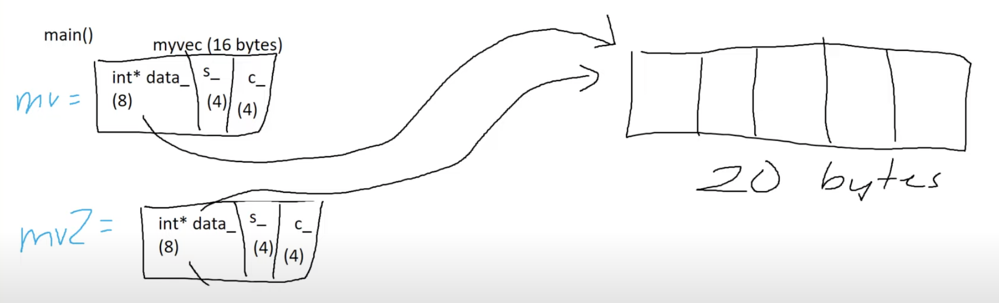
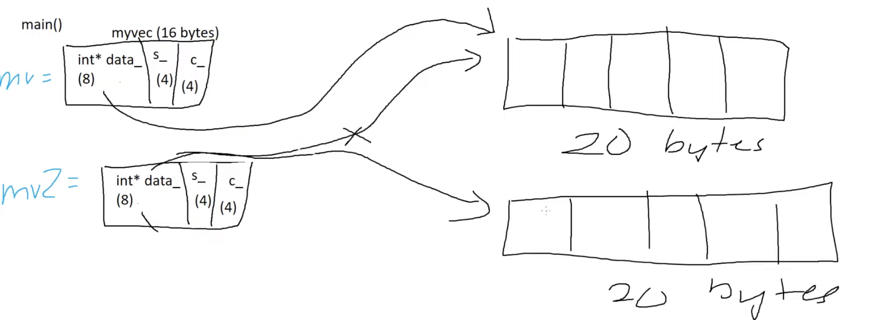

# Lecture 5-Resource Management
[TOC]

## Object
In c++, an object is a region of memory associated with a type. Unlike some other languages (Java), basic types such as int and bool are objects.

What special things can we do with objects:
- Create(Constructor)
- Destroy(Destructor)
- Copy
- Move

## Heap and Stack
**General rule: Stack variables for temportary objects, heap for persistant ones**:
1. Allocated on the stack, the variable persists until the end of the block in which it's defined. 
2. Allocated on the heap, the memory containing the object persists until the end of your program, or until you delete the object.
### Stack Allocation
The allocation happens on contiguous blocks of memory. We call it a stack memory allocation because the allocation happens in the function call stack. The size of memory to be allocated is known to the compiler and whenever a function is called, its variables get memory allocated on the stack. And whenever the function call is over, the memory for the variables is de-allocated. This kind of memory allocation also known as Temporary memory allocation because as soon as the method finishes its execution all the data belongs to that method flushes out from the stack automatically. Means, any value stored in the stack memory scheme is accessible as long as the method hasn’t completed its execution and currently in running state.

**Key Points**:

- It’s a temporary memory allocation scheme where the data members are accessible only if the method( ) that contained them is currently is running.
- It allocates or de-allocates the memory automatically as soon as the corresponding method completes its execution.
- Stack memory allocation is considered safer as compared to heap memory allocation because the data stored can only be access by owner thread.
- Memory allocation and de-allocation is faster as compared to Heap-memory allocation.
- Stack-memory has less storage space as compared to Heap-memory.

```c++
int main()
{
// All these variables get memory
// allocated on stack
int a;
int b[10];
int n = 20;
int c[n];
}
```

### Heap Allocation
It is called heap because it is a pile of memory space available to programmers to allocated and de-allocate. Every time when we made an object it always creates in Heap-space and the referencing information to these objects are always stored in Stack-memory. The data stored in heap space is accessible or visible to all threads. If a programmer does not handle this memory well, a memory leak can happen in the program.

**Key Points**:
- This memory allocation scheme is different from the Stack-space allocation, here no automatic de-allocation feature is provided. We need to use a Garbage collector to remove the old unused objects in order to use the memory efficiently.
- The processing time(Accessing time) of this memory is quite slow as compared to Stack-memory.
- Heap-memory is also not threaded-safe as Stack-memory because data stored in Heap-memory are visible to all threads.
- Size of Heap-memory is quite larger as compared to the Stack-memory.
- Heap-memory is accessible or exists as long as the whole application(or java program) runs.

heap memory through the use of the new keyword:
```c++
int main()
{
// This memory for 10 integers
// is allocated on heap.
int *ptr = new int[10];
}
```

## Long lifetime
There are 3 ways you can try and make an object in C++ have a lifetime that outlives the scope it was defined it:
1. Returning it out of a function via copy (can have limitations)
2. Returning it out of a function via references (bad, see slide below)
3. Returning it out of a function as a heap resource (today's lecture)

### Long lifetime with references
The object must always outlive the reference. There is an important principle: Do not return references to variables local to the function returning. Because the returned object reference on the stack which will be re-used in subsequent code as the program progresses after the return from the function. Like this:
```c++
auto not_okay(int i) -> int& {
  return i;
}

auto not_okay() -> int& {
  auto i = 0;
  return i;
}
```

So we generally follow two principles: 
1. The object must always outlive the reference. 
2. For objects we create INSIDE a function, we're going to have to create heap memory and return that.
```c++
auto okay(int& i) -> int& {
  return i;
}

auto okay(int& i) -> int const& {
  return i;
}
```
```c++
int main()
{
// This memory for 10 integers
// is allocated on heap.
int *ptr = new int[10];
}
```

## New and delete
Objects are either stored on the stack or the heap. In general, most times you've been creating objects of a type it has been on the stack.

We can create heap objects via **new** and free them via **delete** just like in C (malloc/free). New and delete call the constructors/destructors of what they are creating.
```c++
#include <iostream>
#include <vector>

int main() {
  int* a = new int{4};  
  // named resource == stack resource... integer pointer(8 bytes)
  // unamed resource == heap resource... new/malloc(4 bytes)
  std::vector<int>* b = new std::vector<int>{1,2,3};
  std::cout << *a << "\n";
  std::cout << (*b)[0] << "\n";
  delete a;  // if we don't delete a here, the heap resource will not be released.
  delete b;
  return 0;
}
```
Why do we need heap resources?
1. Heap object outlives the scope it was created in.
2. More useful in contexts where we need more explicit control of ongoing memory size (e.g. vector as a dynamically sized array).
3. Stack has limited space on it for storage, heap is much larger.

```c++
#include <iostream>
#include <vector>

int* newInt(int i) {
  int* a = new int{i};
  return a;
}

int main() {
  int* myInt = newInt();
  std::cout << *a << "\n"; // a was defined in a scope that
                           // no longer exists
  delete a;
  return 0;
}
```

Another example:
```c++
int main() {
    std::vector<int>* b = new std::vector<int>{1,2,3};
    std::cout << b << std::endl;
    std::cout << (*b)[0] << std::endl;
    delete b;
    return 0;
}
```
The output is
```shell
0x603000000010
1
```

### std::vector<int> - under the hood
The possible implementation is
```c++
class my_vec {
  // Constructor
  my_vec(int size): data_{new int[size]}, size_{size}, capacity_{size} {}
  
  // Destructor
  ~my_vec() {};

  int* data_;
  int size_;
  int capacity_;
}
```
The problem of the above code is that the pointer type will not be destructed, this will result in a memory leak.

This way could fix it:
```c++
class my_vec {
  // Constructor
  my_vec(int size): data_{new int[size]}, size_{size}, capacity_{size} {}
  
  // Destructor
  ~my_vec() {};

  int* data_;
  int size_;
  int capacity_;
}
	
my_vec::~my_vec() {
  delete[] data_;
}
```

## Rule of 5
When writing a class, if we can't default all of our operators (preferred), we should consider the "rule of 5". The presence or absence of these 5 operations are critical in managing resources.
- Destructor
- Copy constructor
- Copy assignment
- Move assignment
- Move constructor

Whenever you dealing with heap memory, you need to consider these rules.

### std::vector<int> - under the hood
If all data members have one of these defined, then the class should automatically define this for you. But this may not always be what you want.
C++ follows the principle of "only pay for what you use"：
- Zeroing out the data for an int is extra work
- Hence, moving an int actually just copies it
- Same for other basic types

```c++
class my_vec {
  // Constructor
  my_vec(int size): data_{new int[size]}, size_{size}, capacity_{size} {}
  
  // Copy constructor
  my_vec(my_vec const&) = default;
  // Copy assignment
  my_vec& operator=(my_vec const&) = default;
  
  // Move constructor
  my_vec(my_vec&&) noexcept = default;
  // Move assignment
  my_vec& operator=(my_vec&&) noexcept = default;

  // Destructor
  ~my_vec() = default;

  int* data_;
  int size_;
  int capacity_;
}

// Call constructor.
auto vec_short = my_vec(2);
auto vec_long = my_vec(9);
// Doesn't do anything
auto& vec_ref = vec_long;
// Calls copy constructor.
auto vec_short2 = vec_short;
// Calls copy assignment.
vec_short2 = vec_long;
// Calls move constructor.
auto vec_long2 = std::move(vec_long);
// Calls move assignment
vec_long2 = std::move(vec_short);
```

### std::vector<int> - Copy constructor
What does it mean to copy a my_vec?
What does the default synthesized copy constructor do?
- It does a memberwise copy

What are the consequences?
- Any modification to vec_short will also change vec_short2
- We will perform a double free! Since the pointer refer to the same heap space and after mv1 release the space, mv2 can't free.

```c++
class my_vec {
  // Constructor
  my_vec(int size):
    data_{new int[size]},
    size_{size},
    capacity_{size} {}
  
  // Copy constructor
  my_vec(my_vec const&) = default;
  // Copy assignment
  my_vec& operator=(my_vec const&) = default;

  // Destructor
  ~my_vec() = default;

  int* data_;
  int size_;
  int capacity_;
}

int main() {
    auto mv1 = my_vec(4);
    auto mv2 = my_vec(mv1);
    return 0;
}
```
How can we fix this?
We are the resource manager so we can't let the compiler do the default copy assignment in order to avoiding some potential error.
We could use std::copy to copy the elements in the range, defined by [first, last), to another range beginning at d_first.

```c++
my_vec::my_vec(my_vec const& orig): data_{new int[orig.size_]},
                                    size_{orig.size_},
                                    capacity_{orig.capacity_} {
  std::copy(orig.data_, orig.data_ + orig.size_, data_);
}
```

### std::vector<int> - Copy assignment
Assignment is the same as construction, except that there is already a constructed object in your destination.
```c++
// One implementation
my_vec& my_vec::operator=(my_vec const& orig) {
  my_vec(orig).swap(*this); return *this;
}

void my_vec::swap(my_vec& other) {
  std::swap(data_, other.data_);
  std::swap(size_, other.size_);
  std::swap(capacity_, other.capacity_);
}

// Alternate implementation, may not be as performant.
my_vec& my_vec::operator=(my_vec const& orig) {
  my_vec copy = orig;
  std::swap(copy, *this);
  return *this;
}
```

### std::vector<int> - Move constructor
Very similar to copy constructor, except we can use std::exchange instead which will replaces the value of obj with new_value and returns the old value of obj.
```c++
my_vec::my_vec(my_vec&& orig) noexcept
: data_{std::exchange(orig.data_, nullptr)}
, size_{std::exchange(orig.size_, 0)}
, capacity_{std::exchange(orig.capacity_, 0)} {}
```
The orig.data_ will be assigned to the data_, the nullptr will be assigned to orig.data_. The orig object will have unspecified state that it has no size, no capacity and it's data object points to a null pointer.
```c++
auto vec_short = my_vec(2);
auto vec_short2 = std::move(vec_short);
```
Actually, we still could call the member functions from the moved object, but it's undefinited behaivor which could be performed but has bad results.

### std::vector<int> - Move assignment
Like the move constructor, but the destination is already constructed.
```c++
class my_vec {
public:
  // Constructor
  my_vec(int size): data_{new int[size]}, size_{size}, capacity_{size} {}
  
  // Copy constructor
  my_vec(my_vec const&) = default;
  // Copy assignment
  my_vec& operator=(my_vec const&) = default;
  
  // Move constructor
  my_vec(my_vec&&) noexcept = default;
  // Move assignment
  my_vec& operator=(my_vec&&) noexcept = default;

  // Destructor
  ~my_vec() = default;

  int* data_;
  int size_;
  int capacity_;
}
```
```c++
my_vec& my_vec::operator=(my_vec&& orig) noexcept {
  // The easiest way to write a move assignment is generally to do
  // memberwise swaps, then clean up the orig object.
  // Doing so may mean some redundant code, but it means you don't
  // need to deal with mixed state between objects.
  std::swap(data_, orig.data_);
  std::swap(size_, orig.size_);
  std::swap(capacity_, orig.capacity_);
  
  // The following line may or may not be nessecary, depending on
  // if you decide to add additional constraints to your moved-from object.
  delete[] data_
  orig.data_ = nullptr;
  orig.size_ = 0;
  orig.capacity = 0;
  
  return *this;
}
```
```c++
auto vec_short = my_vec(2);
auto vec_long = my_vec(9);
vec_long = std::move(vec_short);
```

## lvalue vs rvalue
- **lvalue**: An expression that is an object reference(name of the object in memory).
E.G. Variable name, subscript reference
Always has a defined address in memory!
- **rvalue**: Expression that is not an lvalue
E.G. Object literals, return results of functions
Generally has no storage associated with it!

There is a simply principle that anything on the left of the equal is lvalue and on the right is either rvalue and lvalue.

```c++
int main() {
  int i = 5; // 5 is rvalue, i is lvalue
  int j = i; // j is lvalue, i is lvalue
  int k = 4 + i; // 4 + i produces rvalue
                 // then stored in lvalue k
}
```

### lvalue references
There are multiple types of references:
- Lvalue references look like T&
- Lvalue references to const look like T const%

Once the lvalue reference goes out of scope, it may still be needed

### rvalue reference

### std::move
A library function that converts an lvalue to an rvalue so that a "move constructor" (similar to copy constructor) can use it. It could also be explain as that we want to take an object from over here and put it into a new variable without the penalty. We don't want to copy it.
This says "I don't care about this anymore".
All this does is allow the compiler to use rvalue reference overloads.
```c++
// Looks something like this.
T&& move(T& value) {
  return static_cast<T&&>(value);
}
```
```c++
void inner(std::string&& value) {
  value[0] = 'H';
  std::cout << value << '\n';
}

void outer(std::string&& value) {  // && could mean this is moveable and well discuss it in week8.
  inner(std::move(value));
  // Value is now in a valid but unspecified state.
  // Although this isn't a compiler error, this is bad code.
  // Don't access variables that were moved from, except to reconstruct them.
  std::cout << value << '\n';
}

int main() {
  f1("hello"); // This works fine.
  auto s = std::string("hello");
  f2(s); // This fails because i is an lvalue.
}
```
Another example:
```c++
class my_vec {
  // Constructor
  my_vec(int size):
    data_{new int[size]},
    size_{size},
    capacity_{size} {}
  
  // Copy constructor
  my_vec(my_vec const&) = default;
  // Copy assignment
  my_vec& operator=(my_vec const&) = default;
  
  // Move constructor
  my_vec(my_vec&&) noexcept = default;
  // Move assignment
  my_vec& operator=(my_vec&&) noexcept = default;

  // Destructor
  ~my_vec() = default;

  int* data_;
  int size_;
  int capacity_;
}

int main() {
    auto mv1 = my_vec(4);
    auto mv2 = my_vec(std::move(mv1));
    return 0;
}
```

#### Moving objects
- Always declare your moves as noexcept
    - Failing to do so can make your code slower
    - Consider: push_back in a vector
- Unless otherwise specified, objects that have been moved from are in a valid but unspecified state
- Moving is an optimisation on copying
    - The only difference is that when moving, the moved-from object is mutable
    - Not all types can take advantage of this
        - If moving an int, mutating the moved-from int is extra work
        - If moving a vector, mutating the moved-from vector potentially saves a lot of work
- Moved from objects must be placed in a valid state
    - Moved-from containers usually contain the default-constructed value
    - Moved-from types that are cheap to copy are usually unmodified
    - Although this is the only requirement, individual types may add their own constraints
- Compiler-generated move constructor / assignment performs memberwise moves

## Explicitly deleted copies and moves
We may not want a type to be copyable / moveable
If so, we can declare fn() = delete. After that the compiler will not synthehis the functions.
```c++
class T {
  T(const T&) = delete;
  T(T&&) = delete;
  T& operator=(const T&) = delete;
  T& operator=(T&&) = delete;
};
```

## Implicitly deleted copies and moves
- Under certain conditions, the compiler will not generate copies and moves
- The implicitly defined copy constructor calls the copy constructor member-wise
    - If one of its members doesn't have a copy constructor, the compiler can't generate one for you
    - Same applies for copy assignment, move constructor, and move assignment
- Under certain conditions, the compiler will not automatically generate copy / move assignment / constructors
    - eg. If you have manually defined a destructor, the copy constructor isn't generated
- If you define one of the rule of five, you should explictly delete, default, or define all five
    - If the default behaviour isn't sufficient for one of them, it likely isn't sufficient for others
    - Explicitly doing this tells the reader of your code that you have carefully considered this
    - This also means you don't need to remember all of the rules about "if I write X, then is Y generated"


## Reference
1. [Stack & Heap](https://www.geeksforgeeks.org/stack-vs-heap-memory-allocation/)
2. [std::exchange](https://en.cppreference.com/w/cpp/utility/exchange)
