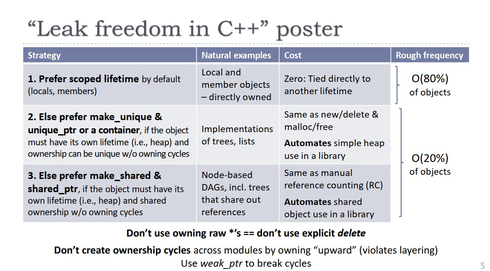

# Week 5-Smart Pointer
[TOC]

## Basis

Why we need smart pointer?
- Managing unnamed / heap memory can be dangerous, as there is always the chance that the resource is not released / free'd properly. We need solutions to help with this.

## RAII - Making unnamed objects safe
This demonstration shows a way to release heap memory when the stack memory war released. But it's just a demo, don't use it in our own code.
```c++
// myintpointer.h

class MyIntPointer {
 public:
  // This is the constructor
  MyIntPointer(int* value);

  // This is the destructor
  ~MyIntPointer();

 int* GetValue();

 private:
  int* value_;
};
```
```c++
// myintpointer.cpp
#include "myintpointer.h"

MyIntPointer::MyIntPointer(int* value): value_{value} {}

int* MyIntPointer::GetValue() {
  return value_
}

MyIntPointer::~MyIntPointer() {
  // Similar to C's free function.
  delete value_;
}
```
```c++
void fn() {
  // Similar to C's malloc
  MyIntPointer p{new int{5}};
  // Copy the pointer;
  MyIntPointer q{p.GetValue()};
  // p and q are both now destructed.
  // What happens?
}
```
## Raw pointer
裸指针的使用通常会出现非常多的问题：
1. 裸指针在声明中没有指出涉及的是一个对象还是一个数组。然而在使用delete运算符的时候我们是需要明确知道要使用单个对象形式的delete还是数组形式的delete[]。如果用错会出发undefinited behavior。
2. 裸指针的声明中无法看出指针是否还拥有它涉及的对象。
3. 有时候难以判断我们需要的析构方式，是用delete还是把指针传入一个专门的析构函数
4. 难以保证在所有代码路径上只析构一次。如果少析构会导致资源泄漏，如果多执行一次会导致undefinited behavior。
5. 无法检测指针是否空悬（dangle）。即对象被析构了但是指针仍然涉及到它。

## Smart pointer
Ways of wrapping unnamed (i.e. raw pointer) heap objects in named stack objects so that object lifetimes can be managed much easier.

### Types
|Type|Shared ownership|Take ownership|
|---|---|---|
|std::unique_ptr<T>|No|Yes|
|raw pointers|No|No|
|std::shared_ptr<T>|Yes|Yes|
|std::weak_ptr<T>|No|No|

Usually two ways of approaching problems:
1. unique_ptr + raw pointers ("observers")
2. shared_ptr + weak_ptr/raw pointers

The ownership of resource is that an owner of a resource is the one who's responsible for correct cleanup of that resource.
- Take ownership: 
- Shared ownership:

### Examples
- Linked list
- Doubly linked list
- Tree
- DAG (mutable and non-mutable)
- Graph (mutable and non-mutable)
- Twitter feed with multiple sections (eg. my posts, popular posts)

## Unique pointer
std::unique_pointer<T>
- The unique pointer owns the object
- When the unique pointer is destructed, the underlying object is too without new and delete
- Two unique_pointer can't point to the same object.

raw pointer (observer)
- Unique Ptr may have many observers
- This is an appropriate use of raw pointers (or references) in C++
- Once the original pointer is destructed, you must ensure you don't access the raw pointers (no checks exist)
- These observers do not have ownership of the pointer
```c++
#include <memory>
#include <iostream>

int main() {
  auto up1 = std::unique_ptr<int>{new int};
  auto up2 = up1; // no copy constructor
  std::unique_ptr<int> up3;
  up3 = up2; // no copy assignment

  up3.reset(up1.release()); // OK
  auto up4 = std::move(up3); // OK
  std::cout << up4.get() << "\n";
  std::cout << *up4 << "\n";
  std::cout << *up1 << "\n";
}
```
The unique pointer doesn't have copy constructor and copy assignment. The release method doesn't destroy the object, just release it and another pointer could point it. It will return a pointer to the managed object.

Another example:
op1 and up1 point to the same resource. Get will not return a unique_pointer, it will return a raw pointer based on the object type.
```c++
#include <memory>
#include <iostream>

int main() {
  auto up1 = std::unique_ptr<int>{new int{0}};
  *up1 = 5;
  std::cout << *up1 << "\n";
  auto op1 = up1.get();
  *op1 = 6;
  std::cout << *op1 << "\n";
  up1.reset();
  // std::cout << *op1 << "\n";  //AddressSanitizer: heap-use-after-free on address
}
```
The output is
```shell
5
6
```

### Unique Ptr Operators
This method avoids the need for "new". It has other benefits that we will explore.

`std::make_unique`: provides the exact same behavior of constructing with a unique pointer. It delegates the them to a constructor of the type you passed in which it puts on the heap.
```c++
#include <iostream>
#include <memory>

auto main() -> int {
	// 1 - Worst - you can accidentally own the resource multiple
	// times, or easily forget to own it.
	// auto* silly_string = new std::string{"Hi"};
	// auto up1 = std::unique_ptr<std::string>(silly_string);
	// auto up11 = std::unique_ptr<std::string>(silly_string);

	// 2 - Not good - requires actual thinking about whether there's a leak.
	auto up2 = std::unique_ptr<std::string>(new std::string("Hello"));

	// 3 - Good - no thinking required.
	auto up3 = std::make_unique<std::string>("Hello");

	std::cout << *up2 << "\n";
	std::cout << *up3 << "\n";
	// std::cout << *(up3.get()) << "\n";
	// std::cout << up3->size();
}
```

## Shared pointers
The difference between the shared pointer and the unique pointers is that multiple shared pointers share ownership of a heap resource. When one shared pointer goes out of the scope. They check if they're the only shard pointer pointing to that resource. If they are the last shared pointer which point to the heap resource, they will also release the heap resource.

`std::shared_pointer<T>`:
Several shared pointers share ownership of the object
- A reference counted pointer
- When a shared pointer is destructed, if it is the only shared pointer left pointing at the object, then the object is destroyed
- May also have many observers
  - Just because the pointer has shared ownership doesn't mean the observers should get ownership too - don't mindlessly copy it

`std::weak_ptr<T>`:
- Weak pointers are used with share pointers when:
  - You don't want to add to the reference count
  - You want to be able to check if the underlying data is still valid before using it.
- Multiply weak pointers also could point to one heap resource. It looks like the raw pointer, but weak pointer have a function to check if the heap resouces valid or not.

Shared pointer usage:
- `use_count`: could get the number of shared pointers which point to the same heap resource.
```c++
#include <iostream>
#include <memory>

auto main() -> int {
	auto x = std::make_shared<int>(5);
	std::cout << "use count: " << x.use_count() << "\n";
	std::cout << "value: " << *x << "\n";
	x.reset(); // Memory still exists, due to y.
	std::cout << "use count: " << y.use_count() << "\n";
	std::cout << "value: " << *y << "\n";
	y.reset(); // Deletes the memory, since
	// no one else owns the memory
	std::cout << "use count: " << x.use_count() << "\n";
	std::cout << "value: " << *y << "\n";
}
```
Another examples of shared pointer:
```c++

```

Weak pointer usage:
- `lock`: get a shared pointer from the weak pointer.
```c++
#include <iostream>
#include <memory>

auto main() -> int {
	auto x = std::make_shared<int>(1);

	auto wp = std::weak_ptr<int>(x); // x owns the memory

	auto y = wp.lock();
	if (y != nullptr) { // x and y own the memory
		// Do something with y
		std::cout << "Attempt 1: " << *y << '\n';
	}
}
```

## When to use which type?
Unique pointer vs shared pointer
- You almost always want a unique pointer over a shared pointer
-  Use a shared pointer if either:
  - An object has multiple owners, and you don't know which one will stay around the longest
  - You need temporary ownership (outside scope of this course)
  - This is very rare


## Leak freedom in Cpp


This image come from [this video](https://www.youtube.com/watch?v=JfmTagWcqoE).

这张图可以总结为三种防止内存泄漏的策略：
1. 使用局部变量和成员对象来限制生命周期。这样会在栈上分配内存，到了声明周期会自动销毁，是最安全的，它们的生命周期都在一定范围内。
2. 如果一个对象必须拥有自己的生命周期（堆），且这个对象的拥有权不会改变，那么优先使用unique_ptr或容器。它们的效率和直接使用 new/delete 或 malloc/free 一样。
3. 其他情况下，使用 shared_ptr。它的效率和手工进行引用计数的效率一样。

## Stack unwinding
Stack unwinding is the process of exiting the stack frames until we find an exception handler for the function.
This calls any destructors on the way out
- **Any resources not managed by destructors won't get freed up**
- If an exception is thrown during stack unwinding, std::terminate is called

在栈展开的过程中，如果被释放的局部变量中有指针，而该指针在此前已经用new运算申请了空间，就有可能导致内存泄露。因为栈展开的时候并不会自动对指针变量执行delete（或delete[]）操作。

First case:
Throws is a kind of stack unwinds and pops stack frames off. So the delete pointer line will never execute. It's not safe.
```c++
void g() {
  throw std::runtime_error{""};
}

int main() {
  auto ptr = new int{5};
  g();
  // Never executed.
  delete ptr;
}
```

Second case:
It's not safe. Because the ptr is a raw pointer when the exception is thrown.
```c++
void g() {
  throw std::runtime_error{""};
}

int main() {
  auto ptr = new int{5};
  g();
  auto uni = std::unique_ptr<int>(ptr);
}
```

Third case:
It's safe since the features of the unqiue pointer which will destroy the object and free the heap resource when the main function is end.
```c++
void g() {
  throw std::runtime_error{""};
}

int main() {
  auto ptr = std::make_unique<int>(5);
  g();
}
```

## Exceptions & Destructors
- During stack unwinding, std::terminate() will be called if an exception leaves a destructor
- The resources may not be released properly if an exception leaves a destructor
- All exceptions that occur inside a destructor should be handled inside the destructor
- Destructors usually don't throw, and need to explicitly opt in to throwing
  - STL types don't do that

## Partial construction
### Problem
What happens if an exception is thrown halfway through a constructor?
- The C++ standard: "An object that is partially constructed or partially destroyed will have destructors executed for all of its fully constructed subobjects"
- A destructor is not called for an object that was partially constructed
- Except for an exception thrown in a constructor that delegates (why?)
```c++
#include <exception>

class my_int {
public:
   my_int(int const i) : i_{i} {
      if (i == 2) {
         throw std::exception();
      }
   }
private:
   int i_;
};

class unsafe_class {
public:
   unsafe_class(int a, int b)
   : a_{new my_int{a}}
   , b_{new my_int{b}}
   {}

  ~unsafe_class() {
    delete a_;
    delete b_;
  }
private:
   my_int* a_;
   my_int* b_;
};

int main() {
  auto a = unsafe_class(1, 2);
}
```
In this example, the my_int{a} and my_int{b} are not fully constructed.

### Solution
- Option 1: Try / catch in the constructor
  - Very messy, but works (if you get it right...)
  - Doesn't work with initialiser lists (needs to be in the body)
- Option 2: An object managing a resource should initialise the resource last
  - The resource is only initialised when the whole object is
  - Consequence: An object can only manage one resource
  - If you want to manage multiple resources, instead manage several wrappers , which each manage one resource.
```c++
#include <exception>
#include <memory>

class my_int {
public:
   my_int(int const i)
   : i_{i} {
      if (i == 2) {
         throw std::exception();
      }
   }
private:
   int i_;
};

class safe_class {
public:
   safe_class(int a, int b)
   : a_(std::make_unique<my_int>(a))
   , b_(std::make_unique<my_int>(b))
   {}
private:
   std::unique_ptr<my_int> a_;
   std::unique_ptr<my_int> b_;
};

int main() {
  auto a = safe_class(1, 2);
}
```