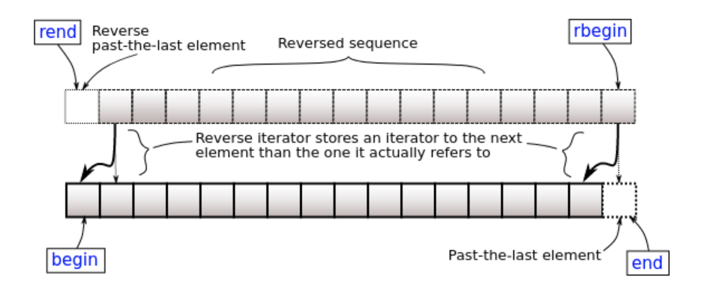

# Custom Iterator
[TOC]

## Iterator revision
Iterator is an abstract notion of a pointer. Iterators are types that abstract container data as a sequence of objects. The glue between containers and algorithms:
- Designers of algorithms don't care about details about data structures.
- Designers of data structures don't have to provide extensive access operations.
```c++
std::vector v{1, 2, 3, 4, 5};
++(*v.begin()); // vector<int>'s non-const iterator
*v.begin(); // vector<int>'s non-const iterator
v.cbegin(); // vector<int>'s const iterator
```

## Iterator invalidation
- What happens when we modify the container?
- What happens to iterators?
- What happens to references to elements?

Using an invalid iterator is undefined behaviour.
```c++
std::vector v{1, 2, 3, 4, 5};
// Copy all 2s
for (auto it = v.begin(); it != v.end(); ++it) {
  if (*it == 2) {
    v.push_back(2);
  }
}
// Erase all 2s
for (auto it = v.begin(); it != v.end(); ++it) {
  if (*it == 2) {
    v.erase(it);
  }
}
```
### Iterator invalidation - push_back
If the new size() is greater than capacity() then all iterators and references (including the past-the-end iterator) are invalidated. Otherwise only the past-the-end iterator is invalidated.

Rcommend to read [this page](http://www.cplusplus.com/reference/vector/vector/push_back/), Iterator validity part 

```c++
std::vector v{1, 2, 3, 4, 5};
// Copy all 2s
for (auto it = v.begin(); it != v.end(); ++it) {
  if (*it == 2) {
    v.push_back(2);
  }
}
```


**Case 1**:
```c++
#include <iostream>
#include <vector>

int main(){
    std::vector v{1, 2, 3, 4, 5};
    v.push_back(6);
    // Copy all 2s
    for (auto it = v.begin(); it != v.end(); ++it) {
        if (*it == 2) {
            std::cout << &*v.begin() << "\n";
            std::cout << &*v.end() << "\n";
            std::cout << v.size() << "\n";
            std::cout << v.capacity() << "\n";
            v.push_back(7);
            std::cout << &*v.begin() << "\n";
            std::cout << &*v.end() << "\n";
            std::cout << v.size() << "\n";
            std::cout << v.capacity() << "\n";
        }
    }

    for (auto it : v ) {
        std::cout << it << " ";
    }
    std::cout << "\n";
}
```

Case 2:
```c++
#include <iostream>
#include <vector>

int main(){
    std::vector v{1, 2, 3, 4, 5, 6};
    // v.push_back(6);
    // Copy all 2s
    for (auto it = v.begin(); it != v.end(); ++it) {
        if (*it == 2) {
            std::cout << &*v.begin() << "\n";
            std::cout << &*v.end() << "\n";
            std::cout << v.size() << "\n";
            std::cout << v.capacity() << "\n";
            v.push_back(7);
            std::cout << &*v.begin() << "\n";
            std::cout << &*v.end() << "\n";
            std::cout << v.size() << "\n";
            std::cout << v.capacity() << "\n";
        }
    }

    for (auto it : v ) {
        std::cout << it << " ";
    }
    std::cout << "\n";
}
```
The output:
```shell
0x15f3280
0x15f3298
6
10
0x15f3280
0x15f329c
7
10
1 2 3 4 5 6 7 
```

The output:
```shell
==80465==ERROR: AddressSanitizer: heap-use-after-free on address 0x603000000018 at pc 0x000000305225 bp 0x7ffec46dba50 sp 0x7ffec46dba48
```


### Iterator invalidation - erase
"Invalidates iterators and references at or after the point of the erase, including the end() iterator."

Iterators, pointers and references pointing to position (or first) and beyond are invalidated, with all iterators, pointers and references to elements before position (or first) are guaranteed to keep referring to the same elements they were referring to before the call.

For this reason, erase returns a new iterator.
```c++
std::vector v{1, 2, 3, 4, 5};
// Erase all even numbers (C++11 and later)
for (auto it = v.begin(); it != v.end(); ) {
  if (*it % 2 == 0) {
    it = v.erase(it);
  } else {
    ++it;
  }
}
```

### Iterator invalidation - general
Containers generally don't invalidate when you modify values. But they may invalidate when removing or adding elements. 
- std::vector invalidates everything when adding elements. 
- std::unordered_(map/set) invalidates everything when adding elements.

## Iterator traits
Each iterator has certain properties:
- Category (input, output, forward, bidirectional, random-access)
- Value type (T)
- Reference Type (T& or const T&)
- Pointer Type (T* or T* const)
    - Not strictly required.
- Difference Type (type used to count how far it is between iterators)

When writing your own iterator, you need to tell the compiler what each of these are 

## Iterator requirements
```c++
class Iterator {
 public:
  using iterator_category = std::forward_iterator_tag;
  using value_type = T;
  using reference = T&;
  using pointer = T*; // Not strictly required, but nice to have.
  using difference_type = int;

  reference operator*() const;
  Iterator& operator++();
  Iterator operator++(int) {
    auto copy{*this};
    ++(*this);
    return copy;
  }
  // This one isn't strictly required, but it's nice to have.
  pointer operator->() const { return &(operator*()); }

  friend bool operator==(const Iterator& lhs, const Iterator& rhs) { ... };
  friend bool operator!=(const Iterator& lhs, const Iterator& rhs) { return !(lhs == rhs); }
};
```

## Container requirements
All a container needs to do is to allow std::[cr]begin / std::[cr]end This allows use in range-for loops, and std algorithms.
Easiest way is to define begin/end/cbegin/cend methods.
By convention, we also define a type Container::[const_]iterator.
```c++
class Container {
  // Make the iterator using one of these by convention.
  class iterator {...};
  using iterator = ...;

  // Need to define these.
  iterator begin();
  iterator end();

  // If you want const iterators (hint: you do), define these.
  const_iterator begin() const { return cbegin(); }
  const_iterator cbegin() const;
  const_iterator end() const { return cend(); }
  const_iterator cend() const;
};
```

## Dissecting IntStack
- The iterator traits
- The overloaded operators (*, ->)
- The equality operators
- The constructor (default to nullptr)
- The private data
    - The iterator is defined inside the class, so gets access to private data
- Iterator defines the container as a friend class for the constructors
- Key points in the List Class:
    - begin() – returns an Iterator object
    - end() – returns an Iterator object (with nullptr as private data)
- Note: The Iterator Class does not modify the List/Node data except through returning references.

```c++
#include <algorithm>
#include <iostream>
#include <iterator>
#include <memory>
#include <utility>

using std::begin;
using std::cbegin;
using std::end;

class IntStack {
private:
	struct Node {
		Node(int value, std::unique_ptr<Node>&& next)
		: value{value}
		, next{std::move(next)} {}
		int value;
		std::unique_ptr<Node> next;
	};

	// Exercise to the reader once we've covered templates:
	// Try making the const iterator and the non-const iterator with one class template.
	class Iterator {
	public:
		using iterator_category = std::forward_iterator_tag;
		using value_type = int;
		using reference = int&;
		using pointer = int*;
		using difference_type = int;

		reference operator*() const {
			return node_->value;
		}
		pointer operator->() const {
			return &(operator*());
		}
		Iterator operator++() {
			node_ = node_->next.get();
			return *this;
		}
		Iterator operator++(int) {
			auto copy{*this};
			++(*this);
			return copy;
		}

		friend bool operator==(const Iterator& lhs, const Iterator& rhs) {
			return lhs.node_ == rhs.node_;
		}

		friend bool operator!=(const Iterator& lhs, const Iterator& rhs) {
			return !(lhs == rhs);
		}

	private:
		explicit Iterator(Node* node)
		: node_{node} {}
		Node* node_;

		friend class IntStack;
	};

public:
	// TODO(lecture): show how make const and non-const iterators during lecture.
	using iterator = Iterator;
	using const_iterator = Iterator;

	iterator begin() {
		return iterator{head_.get()};
	}
	const_iterator begin() const {
		return cbegin();
	}
	const_iterator cbegin() const {
		return const_iterator{head_.get()};
	}
	iterator end() {
		return iterator{nullptr};
	}
	const_iterator end() const {
		return cend();
	}
	const_iterator cend() const {
		return const_iterator{nullptr};
	}

	void push(int value) {
		head_ = std::make_unique<Node>(value, std::move(head_));
	}

	// TODO(students): Why doesn't std::stack::pop return the value you pop?
	void pop() {
		head_ = std::move(head_->next);
	}

	const int& top() const {
		return *cbegin();
	}
	int& top() {
		return *begin();
	}

private:
	std::unique_ptr<Node> head_;
};
```

## Custom bidirectional iterators
Need to define operator--() on your iterator.
- Need to move from c.end() to the last element.
    - c.end() can't just be nullptr.
Need to define the following on your container:
```c++
class Container {
  // Make the iterator
  class reverse_iterator {...};
  // or
  using reverse_iterator = ...;

  // Need to define these.
  reverse_iterator rbegin();
  reverse_iterator rend();

  // If you want const reverse iterators (hint: you do), define these.
  const_reverse_iterator rbegin() const { return crbegin(); }
  const_reverse_iterator crbegin();
  const_reverse_iterator rend() const { return crend(); }
  const_reverse_iterator crend() const;
};
```

## Automatic reverse iterators
- Reverse iterators can be created by std::reverse_iterator.
    - Requires a bidirectional iterator.
- You should be able to just copy-and-paste the following code.
```c++
class Container {
  // Make the iterator using these.
  using reverse_iterator = std::reverse_iterator<iterator>;
  using const_reverse_iterator = std::reverse_iterator<const_iterator>;

  // Need to define these.
  reverse_iterator rbegin() { return reverse_iterator{end()}; }
  reverse_iterator rend() { return reverse_iterator{begin()}; }

  // If you want const reverse iterators (hint: you do), define these.
  const_reverse_iterator rbegin() const { return crbegin(); }
  const_reverse_iterator rend() const { return crend(); }
  const_reverse_iterator crbegin() const { return const_reverse_iterator{cend()}; }
  const_reverse_iterator crend() const { return const_reverse_iterator{cbegin()}; }
};
```

- Reverse iterators can be created by std::reverse_iterator
​   - rbegin() stores end(), so *rbegin is actually *(--end())


## Random access iterators
```c++
class Iterator {
  ...
  using reference = T&;
  using difference_type = int;

  Iterator& operator+=(difference_type rhs) { ... }
  Iterator& operator-=(difference_type rhs) { return *this += (-rhs); }
  reference operator[](difference_type index) { return *(*this + index); }

  friend Iterator operator+(const Iterator& lhs, difference_type rhs) {
    Iterator copy{*this};
    return copy += rhs;
  }
  friend Iterator operator+(difference_type lhs, const Iterator& rhs) { return rhs + lhs; }
  friend Iterator operator-(const Iterator& lhs, difference_type rhs) { return lhs + (-rhs); }
  friend difference_type operator-(const Iterator& lhs, const Iterator& rhs) { ... }

  friend bool operator<(Iterator lhs, Iterator rhs) { return rhs - lhs > 0; }
  friend bool operator>(Iterator lhs, Iterator rhs) { return rhs - lhs < 0; }
  friend bool operator<=(Iterator lhs, Iterator rhs) { !(lhs > rhs); }
  friend bool operator>=(Iterator lhs, Iterator rhs) { !(lhs < rhs); }
}
```
