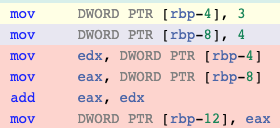
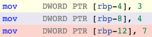
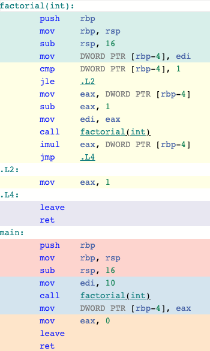
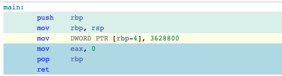

# Template
[TOC]

## Polymorphism & Generic Programming

**Static polymorphism**: polymorphism at compile time.
**Dynamic polymorphism**: polymorphism at program running time.
**Genering Programing**: Generalising software components to be independent of a particular type.

## Function Templates
Withoud generic programming, to create two logically identical functions that behave in a way that is independent to the type, we have to rely on **function overloading**.
```c++
#include <iostream>

auto min(int a, int b) -> int {
	return a < b ? a : b;
}

auto min(double a, double b) -> double{
	return a < b ? a : b;
}

auto main() -> int {
	std::cout << min(1, 2) << "\n"; // calls line 1
	std::cout << min(1.0, 2.0) << "\n"; // calls line 4
}
```

**Function template**: Prescription (i.e. instruction) for the compiler to generate particular instances of a function varying by type. 

The generation of a templated function for a particular type T only happens when a call to that function is seen during compile time. If the functions are not called, there is no instantiation in the binary. The number of instantiation is determined by the number of calls.

The simple idea is to pass data type as a parameter so that we don't need to write the same code for different data types.
```c++
#include <iostream>

template <typename T>
auto min(T a, T b) -> T {
	return a < b ? a : b;
}

auto main() -> int {
	std::cout << min(1, 2) << "\n"; // calls int min(int, int)
	std::cout << min(1.0, 2.0) << "\n"; // calls double min(double, double)
}
```

**What is the difference between function overloading and templates?**
Both function overloading and templates are examples of polymorphism feature of OOP. Function overloading is used when multiple functions do similar operations, templates are used when multiple functions do identical operations.

**The difference between using auto and template?**
In the below example, the compiler will throw error since there is two seperate type, int and double. But if we use auto, it will be compiled. Template only takes in one type.
```c++
#include <iostream>

template <typename T>
auto min(T a, T b) -> T {
	return a < b ? a : b;
}

auto main() -> int {
	std::cout << min(1, 2.0) << "\n"; // calls double min(int, double)
}
```
This could be compiled.
```c++
#include <iostream>

template <typename T, typename U>
auto min(T a, U b) -> T {
	return a < b ? a : b;
}

auto main() -> int {
	std::cout << min(1, 2.0) << "\n"; // calls double min(int, double)
}
```


## Type and Nontype Parameters
**Type parameter**: Unknown type with no value
**Nontype parameter**:Known type with unknown value, \<Type value\>
```c++
#include <array>
#include <iostream>

template<typename T, std::size_t size>
auto findmin(const std::array<T, size> a) -> T {
	T min = a[0];
	for (std::size_t i = 1; i < size; ++i) {
		if (a[i] < min)
			min = a[i];
	}
	return min;
}

auto main() -> int {
	std::array<int, 3> x{3, 1, 2};
	std::array<double, 4> y{3.3, 1.1, 2.2, 4.4};
	std::cout << "min of x = " << findmin(x) << "\n";
	std::cout << "min of x = " << findmin(y) << "\n";
}
```
Compiler deduces T and size from a.

Non-type parameters are mainly used for specifying max or min values or any other constant value for a particular instance of a template. The compiler must know the value of non-type parameters at compile time.  Because the compiler needs to create functions/classes for a specified non-type value at compile time. Otherwise, it will causes compiler error as below. The second parameter should be a constant rather than a varibale.
```c++
// A C++ program to demonstrate working of non-type
// parameters to templates in C++.
#include <iostream>
using namespace std;
 
template <class T, int max>
int arrMin(T arr[], int n)
{
   int m = max;
   for (int i = 0; i < n; i++)
      if (arr[i] < m)
         m = arr[i];
 
   return m;
}
 
int main()
{
   int arr1[]  = {10, 20, 15, 12};
   int n1 = sizeof(arr1)/sizeof(arr1[0]);
 
   char arr2[] = {1, 2, 3};
   int n2 = sizeof(arr2)/sizeof(arr2[0]);
 
   // Second template parameter to arrMin must be a constant
   int x = 10000;
   cout << arrMin<int, x>(arr1, n1) << endl;
   cout << arrMin<char, 256>(arr2, n2);
   return 0;
}
```

What is "code explosion"? Why do we have to be weary of it?
- Many overload functions. It will make our binary bigger.

## Class Template
How we would currently make a Stack type?
The stacks below could be overloaded.
```c++
class int_stack {
public:
	auto push(int&) -> void;
	auto pop() -> void;
	auto top() -> int&;
	auto top() const -> const int&;
private:
	std::vector<int> stack_;
};

class double_stack {
public:
	auto push(double&) -> void;
	auto pop() -> void;
	auto top() -> double&;
	auto top() const -> const double&;
private:
	std::vector<double> stack_;
};
```

Template class could solve it.
demo705-classtemp-main.h
```c++
// stack.h
#ifndef STACK_H
#define STACK_H

#include <iostream>
#include <vector>

template<typename T>
class stack {
public:
	friend auto operator<<(std::ostream& os, const stack& s) -> std::ostream& {
		for (const auto& i : s.stack_)
			os << i << " ";
		return os;
	}
	auto push(T const& item) -> void;
	auto pop() -> void;
	auto top() -> T&;
	auto top() const -> const T&;
	auto empty() const -> bool;

private:
	std::vector<T> stack_;
};

#include "./demo705-classtemp.tpp"

#endif // STACK_H
```
demo705-classtemp-main.tpp
```c++
#include "./demo705-classtemp.h"

template<typename T>
auto stack<T>::push(T const& item) -> void {
	stack_.push_back(item);
}

template<typename T>
auto stack<T>::pop() -> void {
	stack_.pop_back();
}

template<typename T>
auto stack<T>::top() -> T& {
	return stack_.back();
}

template<typename T>
auto stack<T>::top() const -> T const& {
	return stack_.back();
}

template<typename T>
auto stack<T>::empty() const -> bool {
	return stack_.empty();
}
```

Default rule-of-five:
```c++
// Default Constructor
template <typename T>
stack<T>::stack() { }

// Copy Constructor
template <typename T>
stack<T>::stack(const stack<T> &s) : stack_{s.stack_} { }
//types  function name               private data member 

// Move Constructor
template <typename T>
stack<T>::stack(Stack<T> &&s) : stack_(std::move(s.stack_)); { }

// Copy Assignment
template <typename T>
stack<T>& stack<T>::operator=(const stack<T> &s) {
  stack_ = s.stack_;
}

// Move Assignment
template <typename T>
stack<T>& stack<T>::operator=(stack<T> &&s) {
  stack_ = std::move(s.stack_);
}

// Destructor
template <typename T>
stack<T>::~stack() { }
```

Summarise: If you are dealing with the type, you should consider to use template.


## Inclusion compilation model
**What is wrong with this?**
main.cpp:(.text+0xf): undefined reference to 'int min<int>(int, int)'

min.h
```c++
template <typename T>
auto min(T a, T b) -> T;
```
min.cpp
```c++
template <typename T>
auto min(T a, T b) -> int {
	return a < b ? a : b;
}
```
main.cpp
```c++
#include <iostream>

auto main() -> int {
	std::cout << min(1, 2) << "\n";
}
```

Template definitions need to be known at **compile time**! (template definitions can't be instantiated at link time because that would require an instantiation for all types).
```c++
template <typename T>
auto min(T a, T b) -> T {
  return a < b ? a : b;
}
```
Will expose implementation details in the .h file.
Can cause slowdown in compilation as every file using min.h will have to instantiate the template, then it's up the linker to ensure there is only 1 instantiation.

### Explicit instantiations
Generally a bad idea.

min.h
```c++
template <typename T>
auto min(T a, T b) -> T;
```
min.cpp
```c++
#include "min.h"
template <typename T>
auto min(T a, T b) -> T {
	return a < b ? a : b;
}

template int min<int>(int, int);
template double min<double>(double, double);
```
main.cpp
```c++
#include <iostream>
#include "min.h"
auto main() -> int {
	std::cout << min(1, 2) << "\n";
    std::cout << min(1.0, 2.0) << "\n";
}
```

### Lazy instantiation
Only member functions that are called are instantiated.

In this case, pop() will not be instantiared(Lazy). Implementations must be in header file, and compiler should only behave as if one Stack<int> was instantiated.

stack.h
```c++
#include <vector>

template <typename T>
class stack {
public:
	stack() {}
	auto pop() -> void;
	auto push(const T& i) -> void;
private:
	std::vector<T> items_;
}

template <typename T>
auto stack<T>::pop() -> void {
	items_.pop_back();
}

template <typename T>
auto stack<T>::push(const T& i) -> void {
	items_.push_back(i);
}
```

main.cpp
```c++
auto main() -> int {
	stack<int> s;
	s.push(5);
}
```

## Static member
Each template instantiation has it's own set of static members. If template create four conrate class, it will has static for each four concrate class.

In this case, s1, s2, s3 share the static member since they are all int stack.
demo706-static.h
```c++
#include <vector>

template<typename T>
class stack {
public:
	stack();
	~stack();
	auto push(T&) -> void;
	auto pop() -> void;
	auto top() -> T&;
	auto top() const -> const T&;
	static int num_stacks_;

private:
	std::vector<T> stack_;
};

template<typename T>
int stack<T>::num_stacks_ = 0;

template<typename T>
stack<T>::stack() {
	num_stacks_++;
}

template<typename T>
stack<T>::~stack() {
	num_stacks_--;
}
```
demo706-static.cpp
```c++
#include <iostream>

#include "./demo706-static.h"

auto main() -> int {
	stack<float> fs;
	stack<int> is1, is2, is3;
	std::cout << stack<float>::num_stacks_ << "\n";
	std::cout << stack<int>::num_stacks_ << "\n";
}
```

## Friends
Each stack instantiation has one unique instantiation of the friend.

In this case, it has two friend functions.
demo707-friend.h
```c++
#include <iostream>
#include <vector>

template<typename T>
class stack {
public:
	auto push(T const&) -> void;
	auto pop() -> void;

	friend auto operator<<(std::ostream& os, stack<T> const& s) -> std::ostream& {
		return os << "My top item is " << s.stack_.back() << "\n";
	}

private:
	std::vector<T> stack_;
};

template<typename T>
auto stack<T>::push(T const& t) -> void {
	stack_.push_back(t);
}
```
demo707-friend.cpp
```c++
#include <iostream>
#include <string>

#include "./stack.h"

auto main() -> int {
	stack<std::string> ss;
	ss.push("Hello");
	std::cout << ss << "\n":

	stack<int> is;
	is.push(5);
	std::cout << is << "\n":
}
```

## Constexpr(Unrelated)
Const expression.

Const expression tells the compiler that it is a variable that can be calculeted at compile time.

Case 1:
```c++
auto main() -> int {
	int a = 3;
	int b = 4;
	int c = a + b;
}
```
In this case, the compiler will add a and b together:


Case 2:
The compiler will calculate c.
```c++
auto main() -> int {
	constexpr int a = 3;
	constexpr int b = 4;
	constexpr int c = a + b;
}
```


Another example:
This is a complex case comparing with constexpr and without constexpr.

Without constptr:
```c++
#include <iostream>

int factorial(int n) {
	return n <= 1 ? 1 : n * factorial(n - 1);
}

auto main() -> int {
    int tenfactorial = factorial(10);
}
```


With constptr:
```c++
#include <iostream>

constexpr int constexpr_factorial(int n) {
	return n <= 1 ? 1 : n * constexpr_factorial(n - 1);
}

auto main() -> int {
	constexpr int tenfactorial = constexpr_factorial(10);
}
```

The compiler calculates the result of the function, 3628800.

**Benefits**:
1. Values that can be determined at compile time mean less processing is needed at runtime, resulting in an overall faster program execution.
2. Shifts potential sources of errors to compile time instead of runtime (easier to debug)