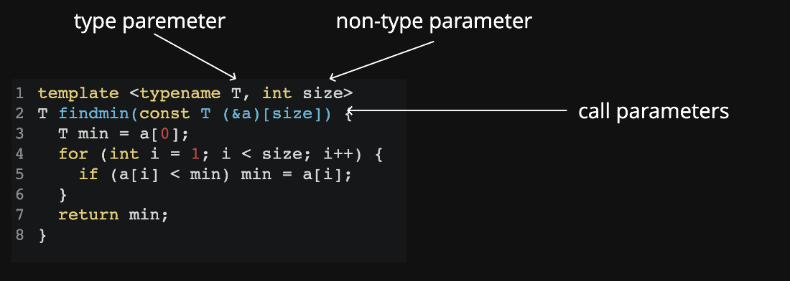

# Advanced Template
[TOC]

## Default Members
- We can provide default arguments to template types (where the defaults themselves are types)
- It means we have to update all of our template parameter lists.

```c++
#include <vector>

template<typename T, typename CONT = std::vector<T>>
class stack {
public:
	stack();
	~stack();
	auto push(T&) -> void;
	auto pop() -> void;
	auto top() -> T&;
	auto top() const -> T const&;
	static int num_stacks_;

private:
	CONT stack_;
};

template<typename T, typename CONT>
int stack<T, CONT>::num_stacks_ = 0;

template<typename T, typename CONT>
stack<T, CONT>::stack() {
	num_stacks_++;
}

template<typename T, typename CONT>
stack<T, CONT>::~stack() {
	num_stacks_--;
}
```
```c++
#include <iostream>

#include "./demo801-default.h"

auto main() -> int {
	auto fs = stack<float>{};
	stack<int> is1, is2, is3;
	std::cout << stack<float>::num_stacks_ << "\n";
	std::cout << stack<int>::num_stacks_ << "\n";
}
```
The output of case is:
```shell
1
3
```

We could also specify the second argument like this:
```c++
#include <iostream>
#include <list>
#include "./demo801-default.h"

auto main() -> int {
	auto fs = stack<float, std::list<float>>{};
	stack<int> is1, is2, is3;
	std::cout << stack<float>::num_stacks_ << "\n";
	std::cout << stack<int>::num_stacks_ << "\n";
}
```
The output is also:
```shell
0
3
```

When we specify the second container as unordered_set, it is whole different with stack\<float\> since the stack\<float\> means stack\<float, std::vector\<float\>\> rather than std::unordere_set:
```c++
#include <iostream>
#include <list>
#include <unordered_set>
#include "./demo801-default.h"

auto main() -> int {
	auto fs = stack<float, std::unordered_set<float>>{};
	stack<int> is1, is2, is3;
	std::cout << stack<float>::num_stacks_ << "\n";
	std::cout << stack<int>::num_stacks_ << "\n";
}
```
The output is:
```c++
0
3
```

Comparing differen cases:
```c++
#include <iostream>
#include <list>
#include <unordered_set>
#include "./demo801-default.h"

auto main() -> int {
	auto fs1 = stack<float, std::unordered_set<float>>{};
	stack<int> is1, is2, is3;
	std::cout << stack<float>::num_stacks_ << "\n";
	std::cout << stack<float, std::unordered_set<float>>::num_stacks_ << "\n";
	std::cout << stack<int>::num_stacks_ << "\n";
}
```
Output:
```c++
0
1
3
```

## Specialisation
### What?
The templates we've defined so far are completely generic.
There are two ways we can redefine our generic types for something more specific:
- Partial specialisation:
	- Describing the template for another form of the template
		- T*
		- std::vector<T>
- Explicit specialisation:
	- Describing the template for a specific, non-generic type
		- std::string
		- int

### When?
- You need to preserve existing semantics for something that would not otherwise work.
	- std::is_pointer is partially specialised over pointers
- You want to write a type trait
	- std::is_integral is fully specialised for int, long, etc.
- There is an optimisation you can make for a specific type.
	- std::vector\<bool\> is fully specialised to reduce memory footprint

### When not?
Don't specialise functions.
- A function cannot be partially specialised
- Fully specialised functions are better done with overloads
- Herb Sutter has an article on this
	- http://www.gotw.ca/publications/mill17.html

You think it would be cool if you changed some feature of the class for a specific type.
- People assume a class works the same for all types
- Don't violate assumptions!

### Partial Specialisation
偏特化
- You can partially specialise classes
	- You cannot partially specialise a particular function of a class in isolation.
- The following a fairly standard example, for illustration purposes only. Specialisation is designed to refine a generic implementation for a specific type, not to change the semantic.
```c++
template <typename T>
class stack<T*> {
public:
	auto push(T* t) -> void { stack_.push_back(t); }
	auto top() -> T* { return stack_.back(); }
	auto pop() -> void { stack_.pop_back(); }
	auto size() const -> int { return stack_.size(); };
	auto sum() -> int{
		return std::accumulate(stack_.begin(),
          stack_.end(), 0, [] (int a, T *b) { return a + *b; });
	}
private:
	std::vector<T*> stack_;
};
```
```c++
#include "./demo802-partial.h"

auto main() -> int {
	auto i1 = 6771;
	auto i2 = 1917;

	auto s1 = stack<int>{};
	s1.push(i1);
	s1.push(i2);
	std::cout << s1.size() << " ";
	std::cout << s1.top() << " ";
	std::cout << s1.sum() << "\n";
}
```

偏特化可以分类两类：个数上的偏和范围上的偏：
- 个数上的偏特化：\<typename T， typename U\>两个模版参数缩减到一个\<typename U\>，在class上需要指明class<int, U>
- 范围上的偏特化：\<typename T\>任意类型的T缩减到\<typename T\*>指针类型（指针指向的变量类型不再管），在class上需要指明class\<T*\>

### Explicit Specialisation
全特化
- Explicit specialisation should only be done on classes.
- [std::vector<bool> is an interesting example](http://www.gotw.ca/publications/mill09.htm) and [here](https://stackoverflow.com/questions/17794569/why-isnt-vectorbool-a-stl-container) too
	- std::vector<bool>::reference is not a bool&
```c++
#include <iostream>

template <typename T>
struct is_void {
	static bool const val = false;
};

template<>
struct is_void<void> {
	static bool const val = true;
};

auto main() -> int {
	std::cout << is_void<int>::val << "\n";
	std::cout << is_void<void>::val << "\n";
}
```

## Type Traits
Trait: Class (or class template) that characterises a type。
```c++
#include <iostream>
#include <limits>

auto main() -> int {
	std::cout << std::numeric_limits<double>::min() << "\n";
	std::cout << std::numeric_limits<int>::min() << "\n";
}
```
```c++
template <typename T>
struct numeric_limits {
	static auto min() -> T;
};

template <>
struct numeric_limits<int> {
	static auto min() -> int { return -INT_MAX - 1; }
}

template <>
struct numeric_limits<float> {
	static auto min() -> float { return -FLT_MAX - 1; }
}
```

Traits allow generic template functions to be parameterised.
```c++
#include <array>
#include <iostream>
#include <limits>

template<typename T, std::size_t size>
T findMax(const std::array<T, size>& arr) {
	T largest = std::numeric_limits<T>::min();
	for (auto const& i : arr) {
		if (i > largest)
			largest = i;
	}
	return largest;
}

auto main() -> int {
	auto i = std::array<int, 3>{-1, -2, -3};
	std::cout << findMax<int, 3>(i) << "\n";
	auto j = std::array<double, 3>{1.0, 1.1, 1.2};
	std::cout << findMax<double, 3>(j) << "\n";
}
```
- Below are STL type trait examples for a specialisation and partial specialisation
- This is a good example of partial specialisation
- http://en.cppreference.com/w/cpp/header/type_traits
```c++
#include <iostream>

template <typename T>
struct is_void {
	static const bool val = false;
};

template<>
struct is_void<void> {
	static const bool val = true;
};

auto main() -> int {
	std::cout << is_void<int>::val << "\n";
	std::cout << is_void<void>::val << "\n";
}
```
```c++
#include <iostream>

template <typename T>
struct is_pointer {
	static const bool val = false;
};

template<typename T>
struct is_pointer<T*> {
	static const bool val = true;
};

auto main() -> int {
	std::cout << is_pointer<int*>::val << "\n";
	std::cout << is_pointer<int>::val << "\n";
}
```

### Where it's useful?
Below are STL type trait examples
http://en.cppreference.com/w/cpp/header/type_traits
```c++
#include <iostream>
#include <type_traits>

template<typename T>
auto testIfNumberType(T i) -> void {
	if (std::is_integral<T>::value || std::is_floating_point<T>::value) {
		std::cout << i << " is a number"
		          << "\n";
	}
	else {
		std::cout << i << " is not a number"
		          << "\n";
	}
}

auto main() -> int {
	auto i = int{6};
	auto l = long{7};
	auto d = double{3.14};
	testIfNumberType(i);
	testIfNumberType(l);
	testIfNumberType(d);
	testIfNumberType(123);
	testIfNumberType("Hello");
	auto s = "World";
	testIfNumberType(s);
}
```

## Variadic Templates
可变模板
These are the instantiations that will have been generated.
```c++
#include <iostream>
#include <typeinfo>

template <typename T>
auto print(const T& msg) -> void {
	std::cout << msg << " ";
}

template <typename A, typename... B>
auto print(A head, B... tail) -> void {
	print(head);
	print(tail...);
}

auto main() -> int {
	print(1, 2.0f);
	std::cout << "\n";
	print(1, 2.0f, "Hello");
	std::cout << "\n";
}
```
It's obvious that when we call `print(1, 2.0f, "Hello")`, it will generate the following function from the template function.
```c++
auto print(const char* const& c) -> void {
	std::cout << c << " ";
}

auto print(float const& b) -> void {
	std::cout << b << " ";
}

auto print(float b, const char* c) -> void {
	print(b);
	print(c);
}

auto print(int const& a) -> void {
	std::cout << a << " ";
}

auto print(int a, float b, const char* c) -> void {
	print(a);
	print(b, c);
}
```

## Member Templates
Sometimes templates can be too rigid for our liking:
Clearly, this could work, but doesn't by default
```c++
#include <vector>

template <typename T>
class stack {
public:
	auto push(T& t) -> void { stack._push_back(t); }
	auto top() -> T& { return stack_.back(); }
private:
	std::vector<T> stack_;
};

auto main() -> int {
	auto is1 = stack<int>{};
	is1.push(2);
	is1.push(3);
	auto is2 = stack<int>{is1}; // this works
	auto ds1 = stack<double>{is1}; // this does not
}
```
Through use of member templates, we can extend capabilities. In this case, we could have two different types T and T2. We also need to declare the types in the function implementation.

We can't change `template <typename T> template <typename T2>`to `template <typename T, typename T2>` since the second case means that my object uses two types of objects but the first one means my object uses one type of objects and another object using another type.
```c++
#include <vector>

template <typename T>
class stack {
public:
	explicit stack() {}
	template <typename T2>
	stack(stack<T2>&);
	auto push(T t) -> void { stack_.push_back(t); }
	auto pop() -> T;
	auto empty() const -> bool { return stack_.empty(); }
private:
	std::vector<T> stack_;
};

template <typename T>
T stack<T>::pop() {
	T t = stack_.back();
	stack_.pop_back();
    return t;
}

template <typename T>
template <typename T2>
stack<T>::stack(stack<T2>& s) {
	while (!s.empty()) {
		stack_.push_back(static_cast<T>(s.pop()));
	}
}
```
```c++
auto main() -> int {
	auto is1 = stack<int>{};
	is1.push(2);
	is1.push(3);
	auto is2 = stack<int>{is1}; // this works
	auto ds1 =
	stack<double>{is1}; // this does not work
    // until we do the changes on the left
}
```

## Template Template Parameters
```c++
template <typename T, template <typename> typename CONT>
class stack {}
```
Previously, when we want to have a Stack with templated container type we had to do the following:
- What is the issue with this?
	- We need to declare the type of std::vector twice.
```c++
#include <iostream>
#include <vector>

auto main(void) -> int {
	stack<int, std::vector<int>> s1;
	s1.push(1);
	s1.push(2);
	std::cout << "s1: " << s1 << "\n";

	stack<float, std::vector<float>> s2;
	s2.push(1.1);
	s2.push(2.2);
	std::cout << "s2: " << s2 << "\n";
	//stack<float, std::vector<int>> s2; :O
} 
```
We could ignore the type of std::vector.
```c++
#include <iostream>
#include <vector>

auto main(void) -> int {
  stack<int, std::vector> s1;
  s1.push(1);
  s1.push(2);
  std::cout << "s1: " << s1 << std::endl;

  stack<float, std::vector> s2;
  s2.push(1.1);
  s2.push(2.2);
  std::cout << "s2: " << s2 << std::endl;
} 
```

Other cases:
First example:
```c++
#include <iostream>
#include <vector>

template <typename T, typename Cont>
class stack {
public:
	auto push(T t) -> void { stack_.push_back(t); }
	auto pop() -> void { stack_.pop_back(); }
	auto top() -> T& { return stack_.back(); }
	auto empty() const -> bool { return stack_.empty(); }
private:
	CONT stack_;
};
```
```c++
auto main(void) -> int {
	stack<int, std::vector<int>> s1;
	int i1 = 1;
	int i2 = 2;
	s1.push(i1);
	s1.push(i2);
	while (!s1.empty()) {
		std::cout << s1.top() << " ";
		s1.pop();
	}
	std::cout << "\n";
} 
```
Second example:
```c++
#include <iostream>
#include <vector>
#include <memory>

template <typename T, template <typename...> typename CONT>
class stack {
public:
	auto push(T t) -> void { stack_.push_back(t); }
	auto pop() -> void { stack_.pop_back(); }
	auto top() -> T& { return stack_.back(); }
	auto empty() const -> bool { return stack_.empty(); }
private:
	CONT<T> stack_;
};
```
```c++
#include <iostream>
#include <vector>

auto main(void) -> int {
	auto s1 = stack<int, std::vector>{};
	s1.push(1);
	s1.push(2);
} 
```

## Template Argument Deduction
Template Argument Deduction is the process of determining the types (of type parameters) and the values of nontype parameters from the types of function arguments.


## Implicit Deduction
Non-type parameters: Implicit conversions behave just like normal type conversions
Type parameters: Three possible implicit conversions
... others as well, that we won't go into
```c++
// array to pointer
template <typename T>
f(T* array) {}

int a[] = { 1, 2 };
f(a);
```
```c++
// const qualification
template <typename T>
f(const T item) {}

int a = 5;
f(a); // int => const int;
```
```c++
// conversion to base class
//  from derived class
template <typename T>
void f(base<T> &a) {}

template <typename T>
class derived : public base<T> { }
derived<int> d;
f(d);
```

## Explicit Deduction
If we need more control over the normal deduction process, we can explicitly specify the types being passed in
```c++
template<typename T>
T min(T a, T b) {
	return a < b ? a : b;
}

auto main() -> int {
	auto i = int{0};
	auto d = double{0};
	min(i, static_cast<int>(d)); // int min(int, int)
	// min<int>(i, d); // int min(int, int)
	min(static_cast<double>(i), d); // double min(double, double)
	min<double>(i, d); // double min(double, double)
}
```